# MafiaSalem

**Town-of-Salem-style mechanics on Discord — a ~2,450-line deterministic night engine, layered regression tests (pytest + static smoke checks), crash-resumable tribunal state, and Monte Carlo balance trials.**

> Portfolio write-up · Implementation was **AI-assisted** under my specs and design reviews. **Published:** README + limited MC methodology source + sim_test docs. **Private:** night engine, bot, full trial runners.

---

## Public vs private

| **Published on GitHub** | **Private (local only)** |
|-------------------------|---------------------------|
| This README — architecture, design decisions, balance methodology | `engine/night.py` — night resolution pipeline (~2,450 lines) |
| [`scripts/monte_carlo/`](scripts/monte_carlo/) — **day model, competence AI, role heuristics** | `game.py`, `bot_app/`, `bot.py` — Discord bot + game lifecycle |
| [`scripts/sim_test/README.md`](scripts/sim_test/README.md) — harness architecture + 47-scenario catalog | `scripts/sim_test.py` — runnable scenario/fuzz/systematic harness |
| [`tests/test_monte_carlo_public.py`](tests/test_monte_carlo_public.py) — tests public MC modules | `bridge.py`, `simulate.py`, `generator.py` — engine-backed trials |
| | Full pytest suite, smoke checks, guild secrets (`.env`) |

**Why the split:** MC’s value for balance is the **statistical day layer + pub-lobby AI model** — safe to show. Nights use production `run_night_pipeline` — that stays private.

### What’s on GitHub (file tree)

```text
README.md
scripts/monte_carlo/
  role_universe.py   # 32-role taxonomy (no Discord IDs)
  config.py          # competence model + difficulties
  day.py             # statistical lynch / tribunal weights
  night_ai.py        # pub-lobby night targeting heuristics
  state.py           # Player model + pick helpers
  report.py          # trial output formatting
  diagnostics_report.py
  README.md
scripts/sim_test/
  README.md          # harness architecture + 47-scenario catalog (docs only)
tests/
  test_monte_carlo_public.py
```

Everything else — `engine/`, `game.py`, `bridge.py`, `simulate.py`, `sim_test.py`, `bot_app/` — is **private**.

---

## Design scope — decisions I owned

This is **original product direction** for a custom rules engine and Discord game. I was the **primary decision-maker** on major behavior and architecture — what gets built, how modules split, which invariants are non-negotiable, and when wiki ToS1 is adapted vs ported literally — while the code itself was produced through AI-assisted generation. That includes tradeoffs, module boundaries, verification strategy, Discord UX, and **balance decisions** grounded in Monte Carlo and playtesting feedback loops. The same scope covers the **rules-engine boundary** (one `run_night_pipeline` for Discord, sim_test, and MC), win/endgame and combat/visit semantics, crash-safe persist and commits, and the regression lattice that defines when a bug is actually closed. Balance changes — lobby law, parallel MC infra, or a single role tweak — ship after fresh trials and regression guards pass.

**Representative design areas** (not an exhaustive list):

| System | What I decided |
|--------|-----------------|
| **[Balance & roster policy](#monte-carlo-simulator--statistical-balance-on-real-rules)** | Lobby manifests (`game_roles.py`), charge counts, NK/Exe/Witch constraints — **decided from MC**, not copied from wiki defaults ([example below](#balance-decisions-in-practice)) |
| **[Night pipeline](#night-resolution-pipeline)** | Ordered 14-phase interpreter, transport/control ordering, Chaos injection + triple visit rebuild, effective vs raw visit logs, combat-tier killing, mid-pipeline checkpoints — phase order and boundaries defined explicitly in this codebase |
| **[Custom roles & interactions](#role-roster--32-playable-roles)** | 32-role roster with dupes and neutral pools; per-role state, charges, and cross-role edges (Ret corpses, GA bind, Witch control, Pirate duels, draw-override neutrals, …) |
| **[Monte Carlo](#monte-carlo-simulator--statistical-balance-on-real-rules)** | Hybrid sim, prod↔sim bridge, competence model, ablation framework — plus **parallel worker pool** (one process per CPU core) so multi-million-trial sweeps are practical |
| **[sim_test](#sim_test--night-engine-qa-private-source)** | Second runtime stripping Discord I/O while calling the same `run_night_pipeline`; scenario oracles, fuzz, exhaustive 7p role sets, `--deep` systematic matrices |
| **[Leaderboard & stats](#leaderboard--stats-system)** | SQLite as source of truth, legacy JSON mirror + small repair helper, idempotent `game_key` commits, personal-win taxonomy, live pinned stats board |
| **[Regression & testing](#regression--test-lattice)** | CR01–CR53 issue registry, 168-item combat master list, static AST smoke checks (where the bot is hard to import in CI), review passes (TCR/LB/DR), reiterating guards — what counts as “fixed” and what gets a permanent guard |
| **[Tribunal & day UX](#tribunal--day-phase-state-machine)** | Reaction polls, VC mute/stand roles, deadline resume, haunt voter eligibility, trial-day refunds |
| **[Production hardening](#advanced-production-systems)** | Phased `!resolve` resume, effective-visit algebra, DM outbox, endgame win graph (stalemate / draw overrides), hybrid night-command factory |

### Balance decisions in practice

Two examples where I was the decider — infrastructure choice first, then roster policy from the numbers:

**1. Parallel MC workers.** Early balance runs were too slow to iterate on. I directed adding **fan-out across all CPU cores** (`run_generator_weighted_trials_parallel`, `default_trial_workers` → one worker per core, capped by trial count). That made **millions of engine-backed trials** routine (500k–1M+ baselines, ablation arms, multi-seed spreads) instead of overnight single-thread jobs — which is what you need before changing live lobby rules.

**2. Lobby composition from trial data (7p / 5p / 6p).**

| Player count | Earlier idea | What MC showed | Shipped manifest |
|--------------|--------------|----------------|------------------|
| **7p** | 4 Town · **2 Mafia** · 1 Neutral | Faction win rates skewed too Mafia-heavy at scale | **4 Town · 1 Mafia · 2 Neutrals** (`tos-rt-dupe` — Mobster solo + two distinct neutral buckets) |
| **5p / 6p** | **Limited** neutral bracket (Jes / Exe / Survivor / GA only) | Win rates more imbalanced than full-pool draws | **Full neutral buckets** on 6p; 5p tuned to the no-neutral / TI+TP+RT manifest that balanced Town vs solo Mobster |

Those calls came from pooled faction rates, per-role **win\|in-lobby** slices, and chunk medians across parallel workers.

The sections below unpack each area for reviewers who want depth without access to the unpublished codebase.

---

## Scale

| Dimension | Scope |
|-----------|--------|
| **Playable roles** | 32 — full roster · [↓ tables](#role-roster--32-playable-roles) |
| **Core engine** | ~2,450 lines `engine/night.py` · ~2,550 lines `game.py` · [↓ pipeline](#night-resolution-pipeline) |
| **Discord surface** | ~1,130 lines `bot_app/tribunal.py` · lifecycle · whispers · wills · [↓ section](#game-lifecycle--daynight-loop) |
| **Automated tests** | **1,135** pytest cases across **83** modules |
| **Static smoke checks** | **3,400+** lines parsing source with `ast` (`tests/smoke/checks_engine.py` alone) — pragmatic CI guards, not a substitute for integration tests |
| **Scenario harness** | **~2,470** lines `sim_test.py` (private) — **10M+** pipeline nights in `--deep` · [↓ section](#sim_test--night-engine-qa-private-source) |
| **Balance simulator** | Engine-backed MC · 500k–1M parallel trials · ablation framework · [↓ section](#monte-carlo-simulator--statistical-balance-on-real-rules) |
| **Day tribunal** | Reaction polls · VC mute/stand roles · deadline resume · CR01–CR05 · [↓ section](#tribunal--day-phase-state-machine) |
| **Leaderboards & analytics** | SQLite canonical store · live pinned embed · 13 leaderboard slices · LB01–LB07 · [↓ section](#leaderboard--stats-system) |
| **Production hardening** | Phased night checkpoint · idempotent endgame stats · stalemate/draw graph · [↓ section](#advanced-production-systems) |
| **Regression lattice** | CR53 + combat master 168 + reiterating guards · [↓ section](#regression--test-lattice) |

At its core this is a **rules engine with a Discord front-end**, backed by invariants, static analysis, property tests, and statistical guardrails.

> Code blocks below are **representative excerpts** — truncated with `...` where logic continues in-repo.

### On this page

[Design scope](#design-scope--decisions-i-owned) · [Architecture](#architecture--three-runtimes-one-truth) · [Game lifecycle](#game-lifecycle--daynight-loop) · [Night pipeline](#night-resolution-pipeline) · [Tribunal](#tribunal--day-phase-state-machine) · [Static smoke checks](#static-smoke-checks-ast) · [sim_test](#sim_test--night-engine-qa-private-source) · [Monte Carlo](#monte-carlo-simulator--statistical-balance-on-real-rules) · [Production systems](#advanced-production-systems) · [Regression lattice](#regression--test-lattice) · [Running the project](#running-the-project)

---

## Role roster — 32 playable roles

Canonical names and faction membership: [`scripts/monte_carlo/role_universe.py`](scripts/monte_carlo/role_universe.py) on GitHub; full blurbs and player-facing copy in private [`roles.py`](roles.py) / [`MAFIA_GAME_GUIDE.md`](MAFIA_GAME_GUIDE.md).

### Town (15)

| Role | Night / day commands | Summary |
|------|----------------------|---------|
| **Retributionist** | `!corpses`, `!reanimate` | **2 uses** — reanimate a Town corpse to perform one ability (Doctor, Sheriff, LO, …) |
| **Doctor** | `!heal` | Heal target nightly; **1 self-heal**; cannot heal revealed Mayor |
| **Sheriff** | `!investigate` | Innocent / suspicious; Mafia, Arsonist, doused, framed → suspicious |
| **Investigator** | `!investigate` | Role **bucket** (ambiguous lists); frames/douses skew results |
| **Lookout** | `!watch` | Visitor names at target house (GK guard & Hypnotist count as visits) |
| **Tracker** | `!track` | Who the target visited (transport can change outcome) |
| **Escort** | `!roleblock` | Roleblock visit; SK aggressive mode can counter-kill |
| **Bodyguard** | `!protect` | Guard target (**1** off-self + **1** self-vest); Powerful counter on successful guard |
| **Vigilante** | `!shoot` | **1** Basic attack; **guilt** (dies start of following night) if shot kills Town |
| **Transporter** | `!transport` | Swap two players’ visit destinations; RB/control immune |
| **Mayor** | `!reveal` (day) | Revealed vote weight **×2**; cannot be healed after reveal |
| **Scary Grandma** | `!alert` | **2** alerts — Powerful kill on visitors; RB + control immune |
| **Psychic** | *(passive)* | Visions after resolve (odd/even pools); RB = no vision |
| **Deputy** | `!shoot` (day, D2+) | **1** Unstoppable day shot; one revolver per town per day |
| **Seer** | `!gaze` | Compare two slots → Friends / Enemies (bucket alignment) |

### Mafia (8)

| Role | Night commands | Summary |
|------|----------------|---------|
| **Mobster** | `!kill` | Mafia **kill** (promotion rules decide who holds the button) |
| **Consort** | `!roleblock` | Mafia roleblock; not GK-blocked on Town targets like Escort |
| **Framer** | `!frame` | **Nights 1–2 only** — target reads suspicious to TI |
| **Gravedigger** | `!hide` | **1 use** — hidden death role if target dies |
| **Hypnotist** | `!hypnotize` | Fake DM (healed/RB/transported/controlled/attacked); **counts as visit** |
| **Mole** | `!investigate` | **1 use** — exact role result (Consig-style) |
| **Tailor** | `!tailor` | **1 use** — fake role on death reveal |
| **Gatekeeper** | `!guard` | **2 uses** — RB non-Mafia visitors to guarded house; guard is a visit |

### Neutral — benign (2)

| Role | Commands | Win condition |
|------|----------|---------------|
| **Survivor** | `!vest` (**2**) | Alive at endgame — wins **with any** faction that wins |
| **Guardian Angel** | `!ward` (**1**, bind only) | Bind must survive; **joint-win** with winning faction if bind alive |

### Neutral — evil (4)

| Role | Commands | Win condition |
|------|----------|---------------|
| **Executioner** | *(passive)* | Assigned Town target **lynched** while you live |
| **Jester** | `!haunt` after lynch | **Lynched**; haunt guilty/abstain voter |
| **Witch** | `!control` | Alive when **Town loses** — joint-win with Mafia/NK |
| **Pirate** | `!plunder` | **2** duel wins that **also kill** (plunder must land) |

### Neutral — killing (2)

| Role | Commands | Win condition |
|------|----------|---------------|
| **Arsonist** | `!douse`, `!ignite`, `!clean` | Solo NK — douse graph + unstoppable ignite |
| **Serial Killer** | `!stab`, `!cautious` | Solo NK — last killer standing; RB immune |

### Neutral — chaotic (1)

| Role | Commands | Win condition |
|------|----------|---------------|
| **Chaos** | `!chaos` (**2**) | Alive at endgame — wins **with whoever wins** (like Survivor) |

### Alphabetical index

`Arsonist` · `Bodyguard` · `Chaos` · `Consort` · `Deputy` · `Doctor` · `Escort` · `Executioner` · `Framer` · `Gatekeeper` · `Gravedigger` · `Guardian Angel` · `Hypnotist` · `Investigator` · `Jester` · `Lookout` · `Mayor` · `Mobster` · `Mole` · `Pirate` · `Psychic` · `Retributionist` · `Scary Grandma` · `Seer` · `Serial Killer` · `Sheriff` · `Survivor` · `Tailor` · `Tracker` · `Transporter` · `Vigilante` · `Witch`

### Lobby composition (7p default manifest)

Typical 7-player **`tos-rt-dupe`** draw: **4 Town** + **1 Mafia** (Mobster solo) + **2 Neutrals** (distinct; at most one NK; Witch/Exe pool rules in [`game_roles.py`](game_roles.py)). Full slot table: [`MAFIASALEM_GDD.md` §2](MAFIASALEM_GDD.md).

---

## Architecture — three runtimes, one truth

Production Discord, deterministic `sim_test`, and Monte Carlo all execute **`run_night_pipeline`** from the same module, so balance numbers and bug repros use the same night logic as live play.

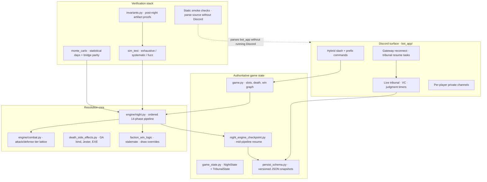

---

## Game lifecycle & day/night loop

The Discord surface is a **persisted state machine** around the rules engine: lobby queue, infrastructure provisioning, alternating day/night phases, and GM `!resolve` orchestration. All game state serializes to `state/{guild_id}.json` via `persist_schema.py` — lobby members survive restarts; mid-game snapshots drive night and tribunal resume.

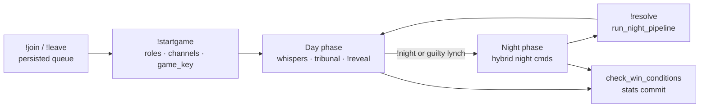

### Lobby → start

| Step | Command / code | What happens |
|------|------------------|--------------|
| **Queue** | `!join` · `!leave` | Players join a persisted waiting list; one active game per player guild-wide. **`!join` is blocked** when disk still has `cleanup_pending`, stale ended game JSON, or matching `pending_endgame` (see [Recovery orchestration](#recovery-orchestration--ops-hardening)) |
| **Preview** | `!players` (≥5p) | Shows [`game_roles.py`](game_roles.py) pool embed — dupes, NK caps, Witch/Exe constraints |
| **Start** | `!startgame` (GM) | DM permission check → `Game.setup_infrastructure` → role draw → deal |

**`!startgame` infrastructure** (`game.setup_infrastructure`): creates or reuses **Mafia Game** category channels — day text/VC, mafia chat, graveyard text/VC — plus **Alive** and **On Stand** roles. Applies **Playing** + **Mafia - Lockdown** category permissions so spectators see day chat while private channels stay hidden. Validates duplicate unique roles before any roles are dealt.

On success: shuffled role assignment, stable **`player_slots`** (target numbers never shift when someone dies), `phase = day`, `day_number = 1`, minted **`game_key`** for stats idempotency, role DMs + private-channel copies of night prompts.

### Day ↔ night loop

| Phase | GM / player actions | Engine touchpoints |
|-------|---------------------|-------------------|
| **Day** | `!whisper`, `!will`, Mayor `!reveal`, Deputy day shot, GM `!vote` tribunal | `start_day` unmutes day VC, posts living count, Deputy prompts from day 2 |
| **Night** | Hybrid night commands (`bot_app/night_factory.py`) | `start_night` clears one-night flags, mutes day VC, DMs action prompts |
| **Resolve** | GM `!resolve` | `run_night_pipeline` → staged deaths → guilt/haunt → Psychic visions → `start_day` |
| **Force** | GM `!night` / `!day` | Manual phase skip (blocked during `resolving` or active tribunal) |

`!resolve` holds `game._night_resolve_guard` and sets `resolving = True` for the whole post-engine path so day commands cannot race half-finished nights. After engine + feedback, **`game.resolving` clears before `start_day`** so `!vote` is not blocked while phase is already `"day"`.

**Excerpt — resolve ends in day transition:**

```python
# bot_app/gm.py (excerpt)
if await game.check_win_conditions():
    return
game.resolving = False  # before start_day — unblocks !vote
await game.start_day(ctx)
```

Win detection (`game.check_win_conditions`) can fire after lynch, night deaths, or stalemate — triggering endgame stats commit and channel cleanup.

### Whispers

Day-only private messaging between living players — **`!whisper <slot> <message>`** (alias `!w`). Must run from the player's **mapped private guild channel** or bot DMs (same privacy model as night actions).

**Guards** (`_whisper_guards_ok`):

- Day phase only; author must be living
- Blocked while **`vote_in_progress`** or tribunal subphase is defense / judgment / last words
- **Revealed Mayor** cannot whisper; cannot whisper **to** a revealed Mayor
- Per-player **`!ignore` / `!unignore`** lists stored in `role_states["whisper_ignored"]`

**Delivery contract** (ToS-accurate ordering):

1. Post to sender's private channel (`whisper_to_sender`)
2. Post to recipient's private channel (`whisper_from_recipient`)
3. Only if **both** succeed → public meta line in game channel (`whisper_public_meta`)

If private delivery fails, players get `whisper_private_channel_failed` — **no public whisper leak**. Public meta failure after successful privates surfaces `whisper_public_delivery_failed` (known open edge: no rollback of private copies — MR09 in GDD).

Private channels map via `config.PLAYER_PRIVATE_CHANNEL_IDS` → [`player_channels.py`](player_channels.py). Night prompts and Deputy day messages use the same helper for players who prefer guild channels over DMs.

```python
# bot_app/players.py (excerpt)
out_ok = await send_to_player_private_channel(..., tos_msg.whisper_to_sender(...))
in_ok = await send_to_player_private_channel(..., tos_msg.whisper_from_recipient(...))
if not (out_ok and in_ok):
    return await safe_reply(ctx, tos_msg.whisper_private_channel_failed())
await post_game_channel(game, ctx.guild, tos_msg.whisper_public_meta(sname, tname))
```

### Last wills & staged death reveal

Last wills are **DM-only** and editable only while alive — up to **1,800 characters** in `role_states["will"]`.

| Command | Behavior |
|---------|----------|
| **`!will`** (DM) | Shows current will + **Edit Will** button → Discord modal (`WillView` / `WillModal` in `bot_app/ui.py`) |
| **`!will clear`** | Clears stored will |
| **Guild use** | Message deleted; bot redirects player to DMs |

On death, wills are not dumped inline with the kill notice. `Game._post_staged_death` posts **five resumable steps** to the game channel (each step persisted as `death_announce_step` for crash recovery — **CR18**):

1. **Death notice** — player name + cause tag  
2. **Cause line** — mapped from `night_death_causes` / lynch / haunt / guilt  
3. **Will discovery** — found / not found / unreadable (SK counter-attack)  
4. **Role reveal** — actual role, **Tailor fake**, or **Gravedigger hidden**  
5. **Will body** — fenced text (skipped for SK counter kills)

```python
# game.py (excerpt)
async def _post_staged_death(self, guild, member_id, cause, *, custom_line1=None):
    ...
    if not await _advance(1, line1): return          # notice
    ... death_cause_line(tag)                        # step 2
    ... will_found() / will_not_found()              # step 3
    ... role_was() or role_unknown()                 # step 4
    ... post fenced will_text                        # step 5
```

`resume_pending_death_announces` on bot restart finishes interrupted sequences from the graveyard ledger — same staged helper, no duplicate posts. Wills are read from role state at death time; editing locks once the player is no longer living.

Player rules copy: [`MAFIA_GAME_GUIDE.md`](MAFIA_GAME_GUIDE.md) · staged death spec: [`MAFIASALEM_GDD.md` §9](MAFIASALEM_GDD.md)

---

## Night resolution pipeline

Every `!resolve` runs **`run_night_pipeline`** in `engine/night.py` (~2,450 lines). It is a **single ordered interpreter** over `game.night_actions` — not a bag of independent handlers. Order matters: Transporter swaps before Witch rewrites pawn targets; Chaos may inject new swaps/actions; visits are rebuilt **three times** after Chaos; misc heals run before investigative feedback; kills run last on the **effective** visit log (blocked visitors stripped).

Production Discord, `sim_test`, and Monte Carlo all call this same function.

### Pipeline map

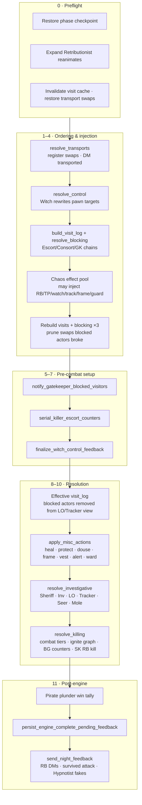

### Phase-by-phase

| Phase | Function | What happens |
|-------|----------|--------------|
| **0 Preflight** | checkpoint restore, `expand_reanimate_actions` | Resume mid-pipeline without double-spend; Ret corpses become real action rows |
| **1 Transport** | `resolve_transports` | Register `(A,B)` in `night_transport_swaps`; DM both players; **does not mutate** submitted targets |
| **2 Witch control** | `resolve_control` | Rewrite pawn's `target` / `targets[0]`; respect control-immune roles + Gatekeeper block on Witch visit |
| **3 Visit log v1** | `build_visit_log` + `resolve_blocking` | Compute visits from **effective destinations** (swap-aware); Escort/Consort/GK roleblock chains |
| **4 Chaos** | inline in pipeline | RNG picks from `CHAOS_EFFECT_POOL` (RB, transport, watch, track, investigate, frame, hide, guard); may inject actions or state; always records `chaos_visit_targets` for LO/SG |
| **3′ Visit log v2–v4** | rebuild ×3 after Chaos | Chaos can add swaps/RBs; each rebuild re-prunes transport swaps when a swap participant was blocked |
| **5 Gatekeeper notify** | `notify_gatekeeper_blocked_visitors` | DMs visitors blocked at guarded house |
| **6 SK vs Escort** | `serial_killer_escort_counters` | SK kills roleblocker when Escort/Consort visits SK |
| **7 Witch feedback** | `finalize_witch_control_feedback` | Strip control if pawn or Witch blocked; DM Witch results / controlled investigative copies |
| **8 Effective visits** | filter `visit_log_raw` | Remove blocked actors from visit lists — Lookout/Tracker/alert semantics |
| **9 Misc** | `apply_misc_actions` | Doctor heal, BG protect (+ counter tier), GA ward, Survivor vest, SG alert, Framer frame, Arsonist douse/clean, Gravedigger hide, Hypnotist fake, etc. → `healed_by_map` / `protected_by_map` |
| **10 Investigative** | `resolve_investigative` | Sheriff suspicious/innocent, Inv buckets, LO visitor list, Tracker trail, Seer Friends/Enemies gaze, Mole exact role; blocked roles get interrupt DMs |
| **11 Killing** | `resolve_killing` | Mafia/Vig/SK/Pirate plunder/ignite; `attack_tier > defense_tier`; alert kills visitors; BG dies countering; unstoppable ignite |
| **12 Pirate win** | inline | Plunder duel won + target died to `pirate_plunder` cause |
| **13 Checkpoint + feedback** | persist + `send_night_feedback` | Snapshot deaths/blocked/heals; DM roleblocks, survived attacks, misc feedback |

### Two visit logs (subtle but critical)

| Log | Contents | Used for |
|-----|----------|----------|
| **`visit_log_raw`** | All visits from effective destinations, **including blocked actors** | Gatekeeper analysis, blocking chain computation |
| **`visit_log` (effective)** | `visit_log_raw` minus visitors in `blocked` | Lookout, Tracker, Scary Grandma alert, kill resolution visitor lists |

Witch control visits the **pawn**, not the forced victim — Lookout on the victim sees the pawn, not the Witch (spec DR15).

### Blocking model

`resolve_blocking` builds a blocked list from:

- **Roleblock** — Escort/Consort (and Chaos-injected RB) on target
- **Gatekeeper guard** — visitors to guarded house blocked (chain-aware: RB'd blockers don't block, etc.)
- **Transport prune** — if a swap participant is blocked, that swap may be removed and visits recomputed

SK **counter-kills** roleblockers in a separate pass before misc/kills.

### Misc phase outputs

`apply_misc_actions` produces maps consumed by killing:

- **`healed_by_map`** — target → Doctor (or Ret-reanimated healer) who healed them
- **`protected_by_map`** — target → list of Bodyguards protecting (with `dies_on_guard` flag)

Multiple doctors can heal different targets same night. GA ward can apply from a dead GA if bind valid.

### Investigative phase

Runs **after** misc so douse/frame/alert state is final for bucket reads. Uses `effective_primary_target` (transport-aware). Blocked investigators get interrupt messages but still consume “sent tonight” flags where applicable.

Sheriff uses apparent role overlays (douse/frame → Arsonist/Framer). Investigator uses bucket lists. Seer gaze compares **buckets** (Friends/Enemies), not raw roles — Witch-forced idle Seer can double-gaze; self-pair → Friends.

Checkpoint: `investigative_phase_complete` prevents duplicate DMs on resume.

### Killing phase

`apply_misc_actions` runs **before** `resolve_killing` (heals/protects). `resolve_killing` clears `night_death_causes` each pass, then:

- **Ignite** — all doused living (+ doused Arsonist quirk); unstoppable tier
- **Direct attacks** — Mafia kill, Vig shoot, SK stab, Pirate plunder duel; **Bodyguard** intercept on protected targets (Powerful counter; guard may die)
- **Tier resolution** — direct kills on unprotected targets
- **Alert** — SG kills visitors on effective visit log (Powerful; pierces Basic, not Powerful heal)
- **Feedback** — attacker/defender/doctor DMs; death-cause priority: ignite/direct/BG assignment, alert uses `setdefault`

Returns `deaths: Set[int]` + populates `game.night_death_causes` per victim.

### Checkpoints inside the pipeline

Phases persist progress into `night_completion_snapshot` so crash-resume skips completed work:

```python
# Simplified checkpoint flags in night_completion_snapshot
transport_control_complete   # + blocked[] payload for Chaos resume
chaos_phase_complete
chaos_roll_in_progress       # mid-roll targets saved before effect applies
misc_phase_complete          # + healed_by / protected_by maps
investigative_phase_complete
killing_phase_complete
gk_sk_witch_notify_complete  # Gatekeeper / SK / Witch DMs sent once
night_engine_running         # set at pipeline entry for resume classification
night_engine_completed       # kills resolved
night_feedback_sent          # DMs delivered
post_pipeline_pending        # guilt / psychic / announce remain
```

Full crash-resume state machine: [Phased night checkpoint](#phased-night-checkpoint--resolve-resume) (Advanced production systems).

**Excerpt — main loop tail (order is contractual):**

```python
# engine/night.py — run_night_pipeline (tail)
visit_log = {t: [v for v in visitors if v not in blocked]
             for t, visitors in visit_log_raw.items()}

healed_by_map, protected_by_map = await apply_misc_actions(game, blocked, guild)
await resolve_investigative(game, blocked, visit_log, guild)
deaths = await resolve_killing(game, visit_log, blocked, healed_by_map, protected_by_map, guild)

await persist_engine_complete_pending_feedback(game, deaths=deaths, ...)
if deliver_feedback:
    await send_night_feedback(game, blocked, guild, deaths=deaths, ...)
return visit_log, blocked, healed_by_map, protected_by_map, deaths
```

Transport-aware visit destinations and crash-resume algebra: [Effective visit algebra](#effective-visit-algebra-transporter-safe).

### Why three visit rebuilds after Chaos (not a convergence loop)

Chaos can inject a **new transport swap** or **roleblock** mid-pipeline. Visits, blocking, and transport pruning depend on each other: a blocked transporter drops their swap, which changes visits, which changes blocking again. After Chaos, `_rebuild_visits_blocking_after_chaos_mutations` loops prune passes until swaps stabilize (max 8); if the cap is hit, one final prune + rebuild still runs so Lookout, combat, and alert match kills.

Crash-resume checkpoints: `transport_control_complete` (with `blocked`), `chaos_phase_complete`, `misc_phase_complete`, `investigative_phase_complete`, `killing_phase_complete`, `gk_sk_witch_notify_complete`, then `post_pipeline_pending` for guilt/psychic/announce. Post-engine snapshots **merge** into the existing snap (`_merge_snap`) so mid-pipeline fields are not dropped.

Spec: [`MAFIASALEM_GDD.md` §5](MAFIASALEM_GDD.md) · player copy: [`MAFIA_GAME_GUIDE.md`](MAFIA_GAME_GUIDE.md)

---

## Tribunal & day-phase state machine

The day phase is not “type a number to lynch.” It is a **~1,130-line distributed state machine** in [`bot_app/tribunal.py`](bot_app/tribunal.py) that coordinates Discord reactions, voice-channel permissions, persisted UTC deadlines, and shared guilty/innocent finish paths — the same code paths for live play and post-crash resume.

**Entry:** Game Overseer runs `!vote` during day phase (max **`VOTE_LIMIT_PER_DAY` = 2** trials per day). Players nominate via emoji reactions; judgment uses ✅ guilty / ❌ innocent on a posted embed.

### Phase flow & timers

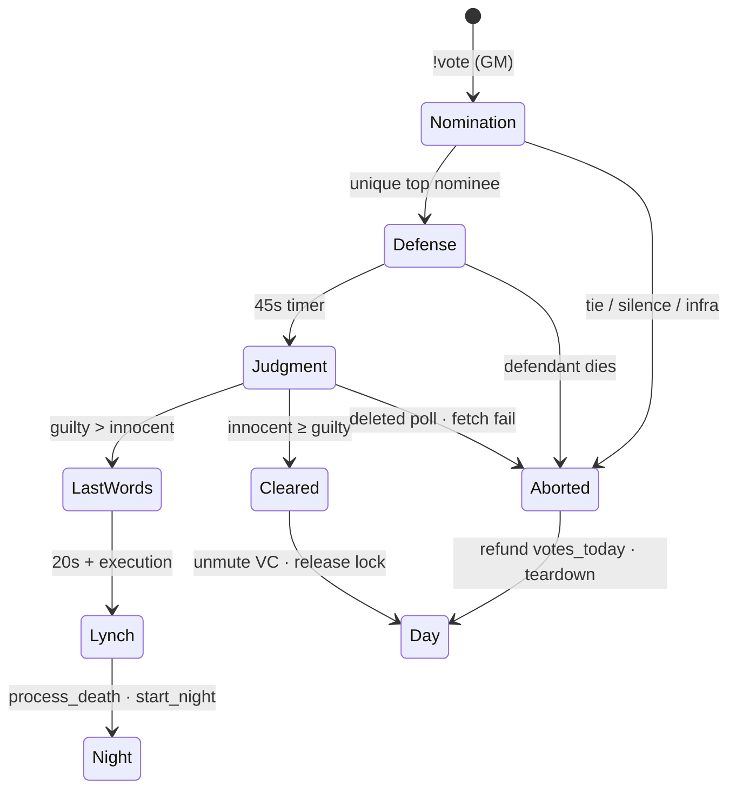

| Phase | Duration | Mechanism |
|-------|----------|-----------|
| **Nomination** | 300s (`VOTE_DURATION`) | Emoji poll on living players (slot order); one vote per living player; **double-react = abstain** |
| **Defense** | 45s | Defendant gets **On Stand** role; day VC: town muted, defendant speaks |
| **Judgment** | 30s | ✅ / ❌ reactions on judgment embed; **revealed Mayor = 2× weight**; double-react = abstain |
| **Last Words** | 20s | Defendant unmuted in VC; then lynch via `process_death` |
| **Verdict** | — | **Guilty only if** `guilty_votes > innocent_votes` (ties spare) |

Nomination rules mirror ToS pressure: **ties or zero votes → no trial**; GA bind targets skip nomination when `ga_trial_lock_day == day_number` (set when GA saves bind at night).

### Persisted state (`TribunalState`)

All in-flight trial data lives on `Game.tribunal_state` and serializes to `state/{guild_id}.json` — not just ephemeral Discord state:

| Field | Purpose |
|-------|---------|
| `vote_in_progress` | Day-phase trial lock — blocks concurrent `!vote` |
| `votes_today` | Trials consumed today (refunded on abort after stand reached) |
| `tribunal_subphase` | `defense` · `judgment` · `last_words` |
| `tribunal_defendant_id` | Who is on trial |
| `tribunal_*_deadline_utc` | Defense / judgment / last-words ISO deadlines for resume |
| `tribunal_judgment_message_id` | Message to fetch reactions from after restart |
| `tribunal_resolved_judgments` | Guilty / innocent / abstain map — **persisted for Jester haunt** |
| `tribunal_verdict_committed` | Prevents double-tally after restart |
| `tribunal_lynch_finisher_done` | Idempotent guard on `_finish_guilty_tribunal` (CR01) |

Flat accessors on `Game` delegate to this dataclass (`game_state.py`).

### Discord integration

- **Day voice channel** — `tribunal_muted`: alive role `speak=False` from stand through verdict; restored on acquittal or teardown.
- **On Stand role** — applied at nomination, removed before judgment tally or on pardon.
- **Game channel embeds** — nomination poll, judgment poll, verdict lines via `tos_msg` + `post_game_channel_embed`.
- **`_tribunal_start_lock`** — asyncio lock so two GMs cannot race two `!vote` handlers.

**Excerpt — unified teardown (three explicit modes):**

```python
# bot_app/tribunal.py
async def teardown_tribunal(game, guild, *, mode: TribunalTeardownMode, ...):
    # live_vote_finally — !vote finally: stand role, partial clear, release lock
    # full_clear       — abort / guilty early exit: VC cleanup + full persisted reset
    # last_words_only  — end of last-words timer: mute defendant, restore town speak
```

Every live `!vote` path ends in `try/finally → _cleanup_live_vote_finally` so snapshot fields clear on cancel; static smoke checks pin that structure after tribunal resume bugs (see [Static smoke checks](#static-smoke-checks-ast)).

### Guilty path — haunt, guilt, night transition

`_finish_guilty_tribunal` is shared by **live judgment** and **post-restart resume**. It:

1. Builds **Jester haunt voter list** from persisted judgments — guilty + abstain only; **innocent voters excluded**
2. Calls `process_death(..., "lynch", eligible_haunt_voters)`
3. Runs `apply_guilt_and_haunt_deaths` (Vig guilt chain)
4. Checks win conditions; otherwise posts execution notice and **`start_night`**
5. Sets `tribunal_lynch_finisher_done` and releases `vote_in_progress` exactly once

```python
# bot_app/tribunal.py (excerpt)
eligible_haunt_voters = await _build_eligible_haunt_voters(
    game, guild, defendant.id, living_ids, resolved_judgments
)
await game.process_death(channel, defendant, "lynch", eligible_haunt_voters)
await apply_guilt_and_haunt_deaths(game, guild, channel, night_kill_deaths=set())
await game.start_night(_ChanCtx(channel))
```

### Crash recovery & `on_ready` resume

Tribunal resume is **deadline-driven**, separate from night pipeline checkpoints. On gateway reconnect (`bot_app/bootstrap.py`):

1. If `vote_in_progress` but game channel deleted → `_bailout_tribunal_resume` (refund + full teardown)
2. Else spawn **at most one** resume task by subphase priority: **defense → judgment → last words → guilty finisher** (`_spawn_tribunal_resume_once` idempotent guard; default `TRIBUNAL_RESUME_MIN_SECONDS=30`)
3. Each task sleeps **remaining seconds** from persisted UTC deadline, then calls the same helper as live play (`_complete_tribunal_after_defense`, `_tribunal_run_judgment_deadline_and_tally`, `_tribunal_last_words_phase`, `_finish_guilty_tribunal`)

**Abort refund:** if a defendant reached the stand but judgment never completes (deleted message, fetch error, phase change, restart bailout), `_refund_tribunal_daily_if_consumed` decrements `votes_today` so the town does not lose a trial day for no verdict.

```python
# bot_app/bootstrap.py (excerpt) — mutually exclusive resume spawns
if t_sub == "defense" and rem_sec in valid_range:
    resume_defense = True
elif t_sub == "judgment" and rem_j in valid_range:
    resume_judgment = True
elif t_sub == "last_words" and rem_lw in valid_range:
    resume_last_words = True
```

### Production guards (CR01–CR05, AST, fuzz)

| Risk | Guard |
|------|-------|
| **CR01** | Guilty finish must release `vote_in_progress` before `start_night` |
| **CR02** | Judgment abort must clear trial lock, not just subphase |
| **CR03** | Verdict commit ordering — snapshot before last words / lynch |
| **CR04** | Resume tasks must not double-spawn judgment (defense resume blocks judgment resume) |
| **CR05** | Stale `vote_in_progress` after innocent verdict — full persisted clear |

AST: `tests/smoke/checks_tribunal.py` — `vote()` `finally` hygiene, judgment reaction guards, refund paths, resume wiring. Property fuzz: [`scripts/tribunal_fuzz.py`](scripts/tribunal_fuzz.py).

Monte Carlo models day trials statistically (`scripts/monte_carlo/day.py` — suspicion → lynch attempt → faction-weighted guilty/innocent); live tribunal implements the full Discord UX on top of the same win/death primitives.

Spec: [`MAFIASALEM_GDD.md` §8](MAFIASALEM_GDD.md) · player rules: [`MAFIA_GAME_GUIDE.md`](MAFIA_GAME_GUIDE.md)

---

## Static smoke checks (AST)

Most coverage is ordinary **pytest** (runtime engine tests, repro JSON, fuzz). A separate layer **parses Python source with `ast`** because `bot.py` is awkward to import in CI (Discord token, live client). These checks are **brittle by design** — they pin structure after real bugs (stuck tribunal, forked resolve pipeline) and will break on harmless refactors unless updated. They complement integration tests; they do not replace them.

**17+ modules** use `ast.parse`, `ast.walk`, `ast.get_source_segment`, and `ast.unparse` to verify:

| Contract type | Example guard |
|---------------|---------------|
| **Delegation stubs** | `Game.resolve()` thin-wrappers must `await` the real `engine/night` entrypoints — no duplicated pipeline |
| **Tribunal `finally` hygiene** | `vote()` try/finally must call `_cleanup_live_vote_finally` — snapshot fields cleared on every exit path |
| **Judgment resume wiring** | `_tribunal_run_judgment_deadline_and_tally` and `_resume_tribunal_judgment_after_restart` present after refactors |
| **Night command registry** | Every hybrid night command registered exactly once — no orphan handlers |
| **Resolve control shape** | Witch rewrite loop structure preserved in `resolve_control` |
| **Privacy invariants** | Role reveals and haunt picks constrained to DM code paths |

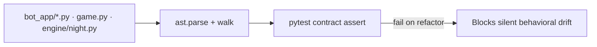

Shared helpers: [`tests/contracts/source.py`](tests/contracts/source.py) · smoke orchestration: [`tests/smoke/core.py`](tests/smoke/core.py)

**Excerpt — static check: `Game` delegates to the engine (no forked pipeline):**

```python
# tests/smoke/checks_engine.py
wrappers = {
    "_resolve_investigative": ("await", "night_engine.resolve_investigative"),
    "_resolve_killing": ("return_await", "night_engine.resolve_killing"),
    ...
}
game_tree = ast.parse(GAME_PY.read_text(encoding="utf-8"))
for method, (mode, target) in wrappers.items():
    fn = _find_game_method(game_tree, method)
    # assert body is exactly one await/return to night_engine.<target>
```

**Excerpt — static check: tribunal `vote()` cleans up in `finally`:**

```python
# tests/smoke/checks_tribunal.py
tree = ast.parse(bot_source_text())
fn = ...  # find vote()
last_try = ...  # find try/finally in vote()
finally_src = "".join(ast.unparse(b) for b in last_try.finalbody)
assert "_cleanup_live_vote_finally" in finally_src
```

Tribunal `finally` checks are the most fragile example — a cleaner long-term fix is a small session type with guaranteed cleanup, tested with mocked Discord.

---

## sim_test — night-engine QA (private source)

> **Runnable source is private** (`scripts/sim_test.py`). On GitHub: [`scripts/sim_test/README.md`](scripts/sim_test/README.md) — full **47-scenario catalog**, four-layer architecture, and CLI presets.

[`scripts/sim_test.py`](scripts/sim_test.py) (~**2,470 lines**, private) is a **behavioral QA harness** that drives the **production** `run_night_pipeline` through a fake Discord surface — no bot token, no guild IDs, no network — while asserting post-night invariants shared with fuzz tests.

It is closer to a **scenario + property-test runner** (scripted oracles, randomized nights, cartesian action matrices, reproducible failure JSON) than to distributed fault injection — single-threaded rules engine, not a partitioned database.

### Why a separate runtime exists

Discord integration makes nights hard to test: async timers, voice state, DM delivery, crash-resume, and GM `!resolve` ordering. `sim_test` strips that away but **keeps the engine path identical**:

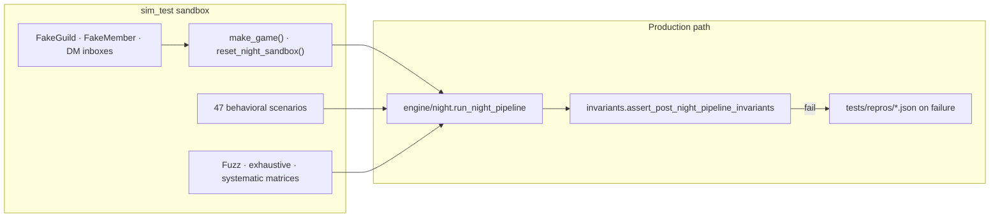

### Layer 1 — Behavioral scenarios (human-written oracles)

**47** ordered scenarios in `SCENARIO_FUNCTIONS` — each constructs a minimal lobby, materializes `night_actions`, runs one pipeline pass, and asserts **exact outcomes** (deaths, DMs, buckets, visit logs, guilt, checkpoints):

| Category | Examples |
|----------|----------|
| **Transport / control** | Witch redirect on Mafia kill; transport does not redirect self-only or Pirate plunder |
| **Arsonist** | Ignite while self-doused; clean removes douse; basic defense survives normal kill |
| **Investigative** | Blocked Sheriff/LO/Tracker interrupts; Inv frame beats douse; Mole Consig reveal |
| **Ret / heal** | Ret reanimate Doctor heal; first-healer-wins on duplicate target; Mayor cannot be healed when revealed |
| **Edge resilience** | Corrupted actions/graveyard/gatekeeper targets must not crash pipeline |

Plus **8 deliberate broken scenarios** (`BROKEN_SCENARIO_FUNCTIONS`) used with `--probe-failure` to confirm the harness reports failures instead of passing silently.

```bash
python scripts/sim_test.py --scenarios-only          # ~47 nights, seconds
python scripts/sim_test.py --probe-failure           # verify failure detection works
python scripts/sim_test.py --broken-scenario-only    # negative tests only
```

**Excerpt — scenario pattern (real engine, fake Discord):**

```python
# scripts/sim_test.py
async def scenario_witch_receives_controlled_sheriff_result():
    game, guild, members = make_game(seed=..., n=7)
    game.player_roles.update({1: "Witch", 2: "Sheriff", 3: "Mobster", ...})
    game.night_actions[1] = {"type": "control", "actor": 1, "target": 2, ...}
    game.night_actions[2] = {"type": "investigate", "actor": 2, "role": "Sheriff", "target": 3}
    out = await run_night_pipeline(game, guild)
    assert_dm_received(members[1], ...)  # Witch gets Sheriff result
    assert_post_night_invariants(game, out)
```

### Layer 2 — Fuzz (randomized action survival)

`fuzz_night_actions_no_throw` generates legal-ish random `night_actions` over weighted role sets. Goal: **never crash**, always satisfy pipeline invariants. Catches shape errors, missing keys, and visit-log drift that scenarios did not imagine.

### Layer 3 — Exhaustive role-set enumeration

For 7-player lineups, enumerate **all legal role combinations** from the generator (**47,775** distinct 7p sets for the RT-dupe manifest) × **N random nights** each — hunting crashes across the entire role universe, not cherry-picked lobbies.

### Layer 4 — Systematic action cartesian (the heavy artillery)

For each role set, pick seat tuples of size **2–5** (`--systematic-tuple-size`). For each tuple, cartesian-product **per-role action variants** (heal targets, investigate targets, corrupt payloads, noop, …) with:

- **Deterministic seeds** per combo (`_materialize_combo_seed` + MD5)
- **Dedup** of identical materialized action JSON
- **Parallel workers** (`ProcessPoolExecutor`, default CPU count)
- Optional **sampling** (`--systematic-sample K`) for tractable subsets

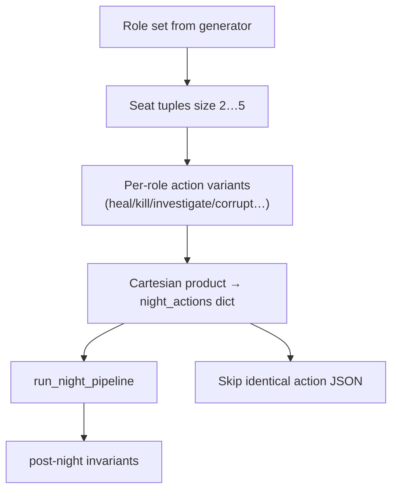

| Preset | Scale (documented in CLI) |
|--------|----------------------------|
| **`--deep`** | 47 scenarios + fuzz 400 + **47,775 × 5** exhaustive nights + sampled 2/3/4-way systematic → **10M+ pipeline invocations**, ~30 min @ 12 workers |
| **`--quad`** | 4-way systematic on 4 role-set manifests, 8p — soak crash hunt ~6 min |
| **`--penta`** | 5-way systematic — ~35 min depth |

### Failure archaeology

Any systematic/exhaustive worker failure writes a **JSON repro** under `tests/repros/` with seed, roles, actions, and stack trace — turn a flaky billion-night run into a **single deterministic pytest fixture**.

**Excerpt — sandbox reset (scenarios don't bleed state):**

```python
# scripts/sim_test.py — reset_night_sandbox()
game.night_actions = {}
game.doused_players.clear()
game.night_death_causes.clear()
game.night_completion_snapshot = None
game.night_transport_swaps = []
game._effective_visit_destinations_cache = None
for seat, role in roles_by_seat.items():
    game.role_states[seat] = _init_state_for_role(role)  # fresh counters
```

**Excerpt — invariant gate on every pipeline run:**

```python
# invariants.py (called from sim_test + MC bridge when ENGINE_NIGHT_INVARIANTS=True)
def assert_post_night_pipeline_invariants(game, out):
    assert_game_runtime_sanity(game)
    assert_no_negative_counters(game)
    for k in ["visit_log_raw", "visit_log", "blocked", "deaths", ...]:
        assert k in out
    # visit_log keys int-only; deaths ⊆ former living; investigative completion flags; ...
```

---

## Monte Carlo simulator — statistical balance on real rules

> **Published on GitHub:** `config.py`, `day.py`, `night_ai.py`, `state.py`, `role_universe.py` — competence model, statistical days, pub-lobby AI.  
> **Private:** `bridge.py`, `simulate.py`, `generator.py` — engine-backed trial runners (`monte_carlo_sim.py`).

[`scripts/monte_carlo/`](scripts/monte_carlo/) is a **hybrid simulator**: nights are **100% engine-faithful** (private `engine/night.py`); days are **statistically modeled** in published `day.py` (suspicion accumulation → lynch probability → faction-aware tribunal weights).

### Is it a "true" Monte Carlo?

**Yes for estimation; no for full-game modeling.**

| Monte Carlo property | This simulator |
|---------------------|----------------|
| Many **independent randomized trials** → aggregate win rates | Yes — `run_generator_weighted_trials_parallel`, `run_monte_carlo`, million-trial baselines |
| Randomness in **inputs** (lobbies, seat order, AI targets, day votes, `MC_ACTION_JITTER`) | Yes |
| Randomness in **night outcomes** given actions | **No** — `bridge.resolve_night_via_engine` → `run_night_pipeline` is deterministic |
| **Production day tribunal** | **No** — `day.py` is a statistical stub (suspicion → trial → faction-weighted guilty votes) |
| **Enumeration modes** | Some CLI paths cartesian-product role sets (`run_enumeration`) — exhaustive, not sampled |

**Practical label:** Monte Carlo **balance estimator** over a **hybrid agent-based model** (heuristic night AI + statistical days + exact engine nights). Good for relative balance and regression after rule changes; not a predictor of live Discord win rates.

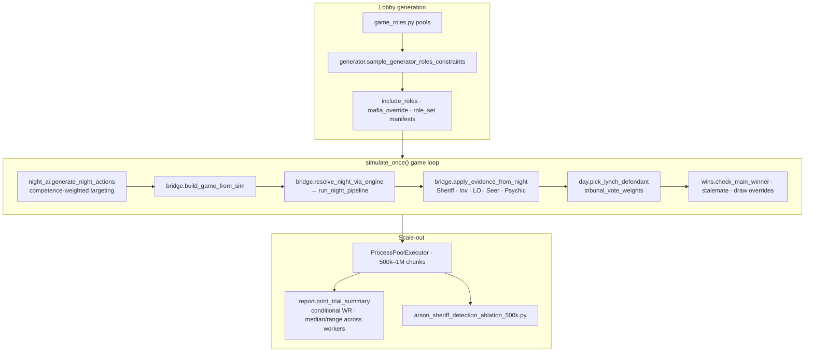

### Prod ↔ sim bridge (the parity contract)

[`bridge.py`](scripts/monte_carlo/bridge.py) is the **adapter layer**:

| Direction | Responsibility |
|-----------|----------------|
| **Sim → Engine** | `build_game_from_sim` maps MC `Player` rows to `Game` + `role_states`; `actions_to_night_actions` |
| **Engine → Sim** | `sync_engine_to_sim` copies deaths, douses, framed flags, Seer pairs, corpse ledger |
| **Evidence** | `apply_evidence_from_night` mirrors prod investigative feedback into suspicion points |
| **Safety** | Optional `ENGINE_NIGHT_INVARIANTS` → `assert_post_night_pipeline_invariants` + death-cause consistency every night |

**Excerpt — engine night inside MC (same pipeline as production):**

```python
# scripts/monte_carlo/bridge.py
def resolve_night_via_engine(game, guild, *, evidence):
    expand_reanimate_actions(game)
    visit_log, blocked, healed_by, protected_by, deaths = run_async(
        _run_pipeline_async(game, guild)  # → run_night_pipeline
    )
    if mc_config.ENGINE_NIGHT_INVARIANTS:
        assert_post_night_pipeline_invariants(game, out)
        assert_night_outcome_consistency(game, out)
    apply_evidence_from_night(game, visit_log=visit_log, blocked=blocked, evidence=evidence)
    ...
```

Shared with production: `faction_win_logic.py`, `stalemate_wins.py`, `draw_override_wins.py`, `reanimate_expand.py`, `night_guilt.py`, `retributionist_consumption.py`.

### Three-axis competence model

MC does not assume perfect Town. Each role has **targeting · usage · day** difficulty scores; `P(optimal)` scales with lobby skill. Transporter, Witch, and Chaos have high targeting difficulty; Psychic passive visions are easy. This models **pub lobby behavior**, not theoretical optimal play.

```python
# scripts/monte_carlo/config.py (concept)
# P(optimal) = clamp(skill * (1 - 0.58 * difficulty[axis]), 0.12, 1.0)
ROLE_TARGETING_DIFFICULTY = {"Transporter": 0.88, "Witch": 0.78, "Sheriff": 0.48, ...}
ROLE_USAGE_DIFFICULTY     = {"Arsonist": 0.62, "Vigilante": 0.55, ...}
ROLE_DAY_DIFFICULTY       = {"Mayor": 0.55, "Deputy": 0.50, ...}
```

### Statistical day model

Days are not skipped randomly — lynch requires a **unique top suspect** with suspicion ≥ 1, trial probability scales as `min(0.95, score × 0.22)`, and tribunal guilty must exceed innocent weight (faction-aware per-voter model). **Zero suspicion → no lynch** — matches design where Town cannot force trials without investigative pressure.

```python
# scripts/monte_carlo/day.py
def lynch_attempt_probability(suspicion):
    if suspicion <= 0:
        return 0.0
    return min(LYNCH_PROB_CAP, suspicion * LYNCH_PROB_PER_SUSPICION)  # +3 Sheriff → 66% trial
```

### Preflight gate before trusting numbers

[`scripts/mc_preflight.py`](scripts/mc_preflight.py) blocks bogus baselines:

1. **Role audit** — MC role universe synced with `config.py`
2. **Golden N1 parity** (`--parity`) — locked scenario outcomes vs engine
3. **pytest MC suite** — bridge invariants, stalemate wins, faction logic

### Reporting & conditional analytics

[`diagnostics_report.py`](scripts/monte_carlo/diagnostics_report.py) aggregates **conditional win rates** with correct denominators — `P(Town | ≥1 town mislynch)`, `P(win | role in lobby)`, investigative density buckets, game length slices — plus **median/range across parallel worker chunks** for million-trial stability checks.

### Case study — Sheriff vs Arsonist ablation (500k × 2 arms)

[`scripts/arson_sheriff_detection_ablation_500k.py`](scripts/arson_sheriff_detection_ablation_500k.py) isolates **one evidence rule** with everything else fixed:

| Arm | Sheriff behavior |
|-----|------------------|
| **Baseline** | Apparent role — Arsonist + doused players suspicious (+3 evidence) |
| **Immune** | True role only — Arsonist/douse overlays invisible to Sheriff |

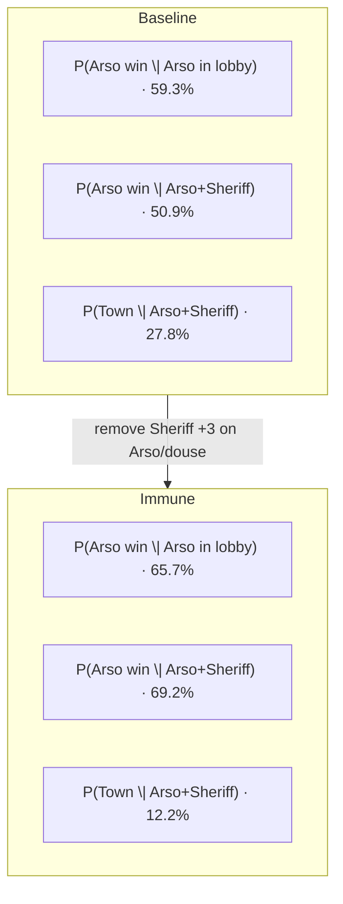

| Slice | Baseline | Immune | Δ |
|-------|----------|--------|---|
| Arsonist in lobby (~25% of lobbies) | 59.3% | 65.7% | +6.4 pp |
| **Arso + Sheriff** (~9% of lobbies) | **50.9%** | **69.2%** | **+18.3 pp** |
| Town (Arso + Sheriff) | 27.8% | 12.2% | −15.6 pp |
| Forced Arso+Sheriff every game | 50.9% | 69.2% | +18.3 pp |

**Interpretation:** Sheriff +3 evidence crosses the lynch threshold (`score ≥ 3`) and triggers a feedback loop (Sheriff re-investigates top suspect). Removing that single rule shifts Arso+Sheriff from **near-even to ~70% Arsonist WR** — measured, not guessed.

**Excerpt — ablation flag + apparent-role overlay:**

```python
# scripts/monte_carlo/bridge.py
def _apparent_role(game, tgt):
    real = game.player_roles.get(tgt, "Unknown")
    if game.role_states.get(tgt, {}).get("is_framed"):
        return "Framer"
    if tgt in game.doused_players or real == "Arsonist":
        return "Arsonist"
    return real

if role == "Sheriff":
    if mc_config.ARSONIST_SHERIFF_DETECTION_IMMUNE:
        suspicious = true_role in ALL_MAFIA_ROLES or framed
    else:
        suspicious = apparent in ALL_MAFIA_ROLES or apparent == "Arsonist" or framed
    if suspicious:
        evidence[tgt] = evidence.get(tgt, 0) + 3
```

### MC quick reference

```bash
python scripts/monte_carlo_sim.py --generator-trials 2000 --player-count 7 --quiet
python scripts/mc_preflight.py --parity
python scripts/arson_sheriff_detection_ablation_500k.py --arm both --force-both
```

Runbook: [`scripts/monte_carlo/README.md`](scripts/monte_carlo/README.md) (public module map + private CLI commands).

---

## Advanced production systems

Beyond the night pipeline and tribunal UX, the live bot includes **crash-recovery**, **endgame stats commits**, and **ToS-accurate endgame logic** — persistence, resume, and idempotent commit patterns suited to long-running game state.

### Recovery orchestration & ops hardening

Endgame recovery spans **game JSON**, stats `_meta`, and SQLite. [`game_recovery.py`](game_recovery.py) centralizes the dangerous paths:

| Concern | Mechanism |
|---------|-----------|
| **Commit before delete** | `commit_pending_endgame_before_state_delete()` runs before `!reset` / `!nuke_reset`, cold-boot stale cleanup, and reconnect `cleanup_pending` reset — while matching game JSON still exists |
| **Lobby clobber** | `lobby_join_blocked_reason()` gates `!join` when disk shows deferred endgame or stale ended state |
| **Disk vs memory** | `get_game_for_guild` loads stale-ended JSON into memory (not a blank placeholder); `!bothealth` shows `disk_recovery_summary()` when disk truth differs |
| **Pending marker durability** | `pending_endgame` writes to stats `_meta`; on meta failure, fallback file `{guild}.pending_endgame.json` |
| **Guild I/O lock** | `persistence.guild_persist_lock()` serializes JSON/stats writes across `Game` instances |
| **Strict deploy** | `MAFIABOT_STRICT_CONFIG=1` fails bot start if SQLite init fails (no silent `bot.db=None`) |
| **Instance lock** | OS file descriptor held for process lifetime; released on shutdown (`_release_single_instance_lock`) |
| **Gateway supervisor** | `_connect_forever` retries after normal `bot.start()` return (no exit on clean session end) |
| **State directory** | Optional `MAFIABOT_STATE_DIR` overrides default `state/` beside `persistence.py` |

Hardened audit regression: [`tests/test_hardened_audit_fixes.py`](tests/test_hardened_audit_fixes.py), [`tests/test_audit_remaining_fixes.py`](tests/test_audit_remaining_fixes.py).

### Phased night checkpoint & `!resolve` resume

If the process dies mid-`!resolve`, the game does **not** restart the night from scratch or double-apply kills. `night_completion_snapshot` records **which pipeline phases finished** — chaos, misc, investigative, engine complete, feedback sent — and `night_resume.parse_night_resume_state` classifies the resume path:

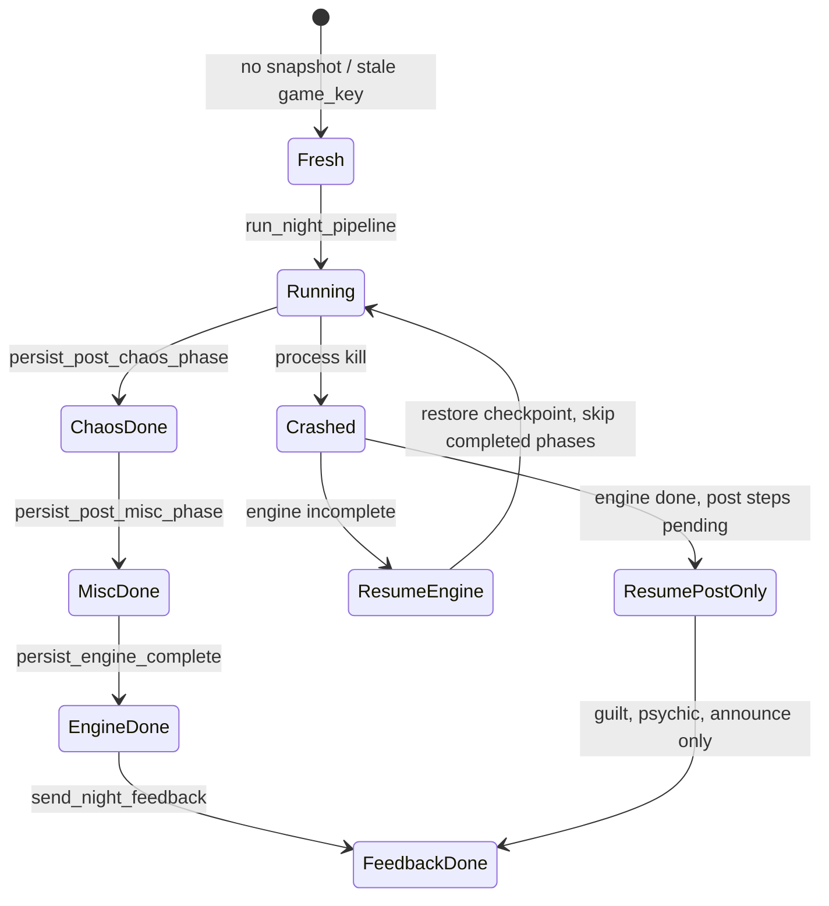

**Excerpt — resume classification (never re-enter engine if already complete):**

```python
# night_resume.py
def parse_night_resume_state(snap, *, day_number, game_key) -> NightResume:
    ...
    engine_completed = bool(norm.get("night_engine_completed"))
    if engine_completed or post_pipeline_pending:
        return NightResume(resuming=True, resume_post_pipeline_only=True, ...)
    return NightResume(resuming=True, resume_engine_incomplete=True, ...)
```

Stale feedback without a completed engine is **detected and cleared** so combat can rerun without duplicating DMs (`apply_stale_night_feedback_recovery`).

### Effective visit algebra (Transporter-safe)

Visits are not read from raw targets. `effective_visit_destinations_map` builds a per-actor destination list, applies **visitor swaps** for each transport pair, respects **visit-immune** actors (e.g. astral GA ward), and memoizes in `_effective_visit_destinations_cache` (invalidated at pipeline entry). Investigative roles, blocks, and Lookout logs all consume this map — one source of truth for “who actually went where.”

```python
# engine/night.py (excerpt)
def effective_visit_destinations_map(game):
    if isinstance(game._effective_visit_destinations_cache, dict):
        return game._effective_visit_destinations_cache
    destinations = {}  # actor → [houses visited]
    for a, b, _tp in game.night_transport_swaps:
        _apply_visitor_swap_to_destinations(destinations, a, b, immune_actor_ids)
    game._effective_visit_destinations_cache = destinations
    return destinations
```

### Endgame stats — SQLite + legacy JSON mirror

Endgame commits are **idempotent** with **`game_key`** deduplication. **SQLite is the source of truth**; a **JSON file mirror** remains for embed/leaderboard code paths that still call `load_stats` — legacy from an earlier stats layout, not a performance requirement (SQLite would suffice alone). After each successful SQLite endgame commit, `repair_guild_json_mirror_from_sqlite` refreshes the JSON `players` snapshot; on cold boot, bootstrap also repairs when the stats JSON file is **absent**.

```python
# stats_mirror_repair.py
def repair_guild_json_mirror_from_sqlite(db, *, guild_id, game_key=None) -> bool:
    players = db.build_json_players_mirror(guild_id=guild_id)  # SQLite → dict
    data = persistence.load_stats(guild_id) or {}
    data["players"] = players
    persistence.save_stats(guild_id, data)
```

Games carry a minted **`game_key`** (`guild_id:started_at:nonce`) so pending endgame rows cannot attach to the wrong session after a failed commit.

### Endgame win graph — stalemate, draw overrides, faction logic

Win detection is not “count bodies.” Shared modules implement ToS1 rules used by **prod, MC, and tests**:

| Module | Responsibility |
|--------|----------------|
| [`faction_win_logic.py`](faction_win_logic.py) | Faction win predicates, NK blocking Town |
| [`stalemate_wins.py`](stalemate_wins.py) | **Two-player stalemate table** (Arso/Escort/Mobster/SK/Transporter pairwise outcomes) |
| [`draw_override_wins.py`](draw_override_wins.py) | Personal neutrals (Survivor, Jester, GA, Pirate, …) **replace Draw** on stalemate |
| [`guardian_angel_wins.py`](guardian_angel_wins.py) | GA bind joint wins + draw override when bind survives |

```python
# stalemate_wins.py — wiki-aligned 2-player outcomes
_TOS1_TWO_PLAYER = {
    ("Arsonist", "Escort"): "Arsonist",
    ("Mobster", "Transporter"): "Town",
    ("Escort", "Serial Killer"): None,  # game continues
    ...
}
```

MC calls the same helpers via `draw_override_wins.apply_stalemate_draw_override` inside `simulate_once` — balance numbers respect personal-win overrides, not naive Draw counts.

### Leaderboard & stats system

Player-facing analytics sit on the same **endgame delta pipeline** as production commits — not a separate counter layer. When a game ends, `compute_player_endgame_deltas` (`endgame_stats.py`) runs once; results feed SQLite (canonical) and the JSON mirror (best-effort), then the pinned stats board refreshes.

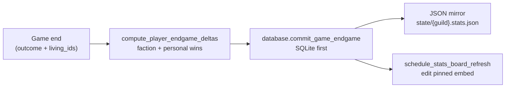

**Storage model** (see also [Endgame stats](#endgame-stats--sqlite--legacy-json-mirror) above):

| Store | Role |
|-------|------|
| `state/mafiabot.db` | Canonical leaderboards, per-game history, stats-board channel/message ids, DM outbox |
| `state/{guild_id}.stats.json` | Read mirror / export; refreshed after each SQLite endgame commit; cold-boot repair when file absent (`stats_mirror_repair.py`) |

Each finished game gets a minted **`game_key`** (`guild_id:started_at:nonce`). Commits are **idempotent** — if both SQLite and JSON already recorded the key, the handler skips re-application but still schedules a board refresh.

**Excerpt — single source of truth for win counting:**

```python
# endgame_stats.py
def compute_player_endgame_deltas(*, player_roles, role_states, living_ids, outcome_norm):
    """Compute per-player endgame deltas once for SQLite commit and JSON mirror."""
    stalemate_override = is_draw_override_outcome(outcome_norm)
    ...
    pirate_win = role == "Pirate" and int(role_state.get("wins", 0)) >= 2
    town_win = outcome_norm == "Town" and role in TOWN_ROLES
    arso_win = outcome_norm == "Arsonist" and role == "Arsonist" and alive
    # GA joint wins, draw overrides, witch_town_loses, etc.
```

#### Player & GM surfaces

| Surface | Command | What it shows |
|---------|---------|---------------|
| **Leaderboard** | `/leaderboard` | Top-10 paginated embed + dropdown — total wins, winrate (min 5 games), faction wins (Town / Mafia / Arsonist), and **9 personal-win slices** (Pirate, Exe, Jester, Survivor, Chaos, Witch, Arsonist, GA, SK) |
| **Personal stats** | `!stats` | Per-player W/L/D, faction breakdown, personal wins — SQLite first, JSON fallback |
| **Server analytics** | `/serverstats` | Overview, outcome %, lobby sizes, avg game length, faction winrates, role popularity, death causes |
| **Live stats board** | `!setstatschannel` (GM) | One **pinned embed per guild**, auto-edited after each game end |

Leaderboard embeds are built in `bot_app/shared.py` (`_build_leaderboard_embed`, `_build_server_stats_embed`) with Discord field chunking for long lists. DB queries run on **`asyncio.to_thread`** so SQLite never blocks the gateway.

```python
# bot_app/shared.py (excerpt)
async def _build_leaderboard_embed(*, db, guild_id, page):
    if page == "total":
        rows = await asyncio.to_thread(db.top_total_wins, guild_id=guild_id, limit=10)
    elif page == "winrate":
        rows = await asyncio.to_thread(db.top_winrate, guild_id=guild_id, min_games=5, limit=10)
    elif page in {"town", "mafia", "arsonist"}:
        rows = await asyncio.to_thread(db.top_faction_wins, ...)
    else:
        rows = await asyncio.to_thread(db.top_personal, guild_id=guild_id, key=page, limit=10)
```

The `/leaderboard` dropdown (`LeaderboardView` / `LeaderboardSelect` in `bot_app/ui.py`) defers immediately and edits the original response — slow disk or a locked DB must not hit Discord’s 3-second interaction deadline.

#### Live stats board refresh

`bot_app/stats_board.py` maintains **one edited message** per guild (channel + message id stored in SQLite). After a successful endgame commit, `schedule_stats_board_refresh` fires a background task guarded by a **per-guild `asyncio.Lock`** so concurrent game ends cannot interleave stale embed edits.

```python
# bot_app/stats_board.py
def schedule_stats_board_refresh(*, bot, guild_id):
    async def _run():
        async with _refresh_lock(guild_id):
            await refresh_guild_stats_board(bot=bot, guild_id=guild_id)
    asyncio.get_running_loop().create_task(_run())
```

GM maintenance: `!refreshstatsboard`, `!exportstats` / `!importstats` (JSON ↔ SQLite with timestamped backup; destructive overwrite requires `!importstats force confirm`). Ops notes: [`STATS.md`](STATS.md).

#### Review contracts (LB01–LB07)

Leaderboard correctness has its own review pass alongside CR and combat master lists — idempotent commits, personal-key migration (`stats_personal.py`), embed limits, and board refresh after draw overrides. Helpers: `tests/leaderboard_review_helpers.py`, `tests/test_stats_board.py`.

### Hybrid commands & durable DM outbox

**Hybrid night commands** (`bot_app/night_factory.py`) and a **SQLite DM outbox** support reliable night play. Hybrid commands declare each night action once (`SingleTargetNightCmd`, `DualTargetNightCmd`, `SelfNightCmd`); the factory registers **`!heal`-style prefix + slash** on the same handler, living-slot autocomplete, cooldowns, phase guards, and writes into `game.night_actions`. The outbox retries DMs when the gateway or member cache fails.

```python
# bot_app/night_factory.py (pattern)
@dataclass(frozen=True)
class SingleTargetNightCmd:
    name: str
    roles: tuple[str, ...]
    action_type: str
    hybrid: bool = True  # slash + prefix on one handler

decorated = only_during_night_gameplay()(commands.cooldown(...)(cmd))
command = bot.hybrid_command()(decorated) if spec.hybrid else bot.command()(decorated)
command.autocomplete("target_number")(living_slot_autocomplete)
REGISTERED_ACTION_TYPES[spec.name] = spec.action_type
```

**SQLite DM outbox** (`database.py` + `bot_app/bootstrap.py`): night results must reach players even when the gateway hiccups or a member is temporarily uncached. Engine paths call `_dm_actor_id` → live `member.send` when possible; otherwise **`enqueue_dm_outbox`** with a **dedupe key** (guild + game_key + day + player + content hash). A background pump task:

- Runs DB work on **`asyncio.to_thread`** so SQLite never blocks the gateway
- **Claims batches**, marks `sending`, delivers, marks `sent`
- **Requeues stale `sending`** rows after 5 minutes (crash mid-send)
- **Retries with backoff** — 429 rate limits respect `retry_after`
- **`enqueue_or_requeue_dm_outbox`** — re-queues terminal `failed` rows with the same dedupe key (e.g. GAME OVER after max attempts)
- **Respawns on `on_ready`** after reconnect so the queue keeps draining

Static check: every `enqueue_dm_outbox` call in product code **must pass `dedupe_key`** (`check_pending_enqueue_dm_outbox_requires_dedupe_key`). GAME OVER uses `enqueue_or_requeue_dm_outbox` so dedupe does not block recovery after a failed row.

```python
# engine/night.py — fall back to outbox when member not in cache
async def _dm_actor_id(game, guild, actor_id, text):
    member = await game.get_member_safe(guild, actor_id)
    if member:
        await _dm_player(member, text)
        return True
    db.enqueue_dm_outbox(
        guild_id=game.guild_id,
        kind="night_result",
        dedupe_key=f"mafia_night:{game.guild_id}:{game_key}:{day}:{actor_id}:{digest}",
        target_user_id=actor_id,
        content=text,
    )
```

```python
# bot_app/bootstrap.py — outbox pump (excerpt)
rows = await asyncio.to_thread(db.claim_dm_outbox_batch, limit=25)
await user.send(content)
await asyncio.to_thread(db.mark_dm_outbox_sent, mid)
# HTTP 429 → retry_dm_outbox_later with retry_after delay
```

---

## Regression & test lattice

Testing is layered beyond one-off pytest cases — multiple **issue registries** with closure tracking and **reiterating guards** (same test run N times to catch order-dependent bugs).

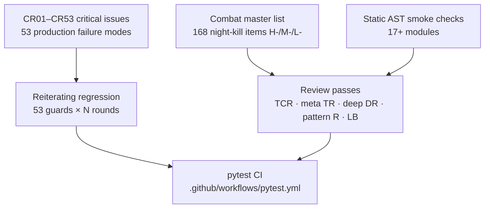

| Layer | Count | What it guards |
|-------|-------|----------------|
| **Critical issues (`CR##`)** | **53** | Stuck tribunal locks, ghost persist, resume ordering, stats mirror drift — each with scenario, impact, code location |
| **Combat master list** | **168** | Every tracked night-kill / combat edge (Pirate vs SK, ignite unstoppable, BG counter tier, …) |
| **Reiterating regression** | **53 × N** | Each `CR` guard rerun `MAFIABOT_REITERATION_ROUNDS` times (default 2) — [`test_reiterating_regression.py`](tests/test_reiterating_regression.py) |
| **Review contract suites** | **6+ modules** | `test_tos_*`, `test_deep_review_*`, `test_meta_review_*`, message standardization, leaderboard contracts |
| **Smoke split** | **3,400+ lines** | `checks_engine`, `checks_tribunal`, `checks_bot`, `checks_game` — static checks runnable without a Discord token |

**Excerpt — reiterating guard (flake-resistant critical paths):**

```python
# tests/test_reiterating_regression.py
# Each guard runs MAFIABOT_REITERATION_ROUNDS times (default 2).
@pytest.mark.parametrize("issue_id", CRITICAL_ISSUE_IDS)
def test_critical_issue_documented(issue_id):
    issue = critical_by_id(issue_id)
    assert issue.scenario.strip() and issue.impact.strip()
# CRITICAL_GUARDS: 53 callable guards mapped 1:1 to CR01–CR53
```

**Excerpt — combat master list registry (168 tracked closures):**

```python
# tests/combat_master_list_helpers.py
COMBAT_MASTER_ISSUE_IDS: tuple[str, ...] = ( ... )  # 168 items
def build_combat_master_issue_list() -> tuple[CombatMasterIssue, ...]:
    return COMBAT_MASTER_ISSUES
```

Persisted blobs are **validated on load** — corrupt transport swap tuples are dropped with warnings (`persist_validation.normalize_night_transport_swaps`), and night snapshots are coerced through `normalize_night_completion_snapshot` before resume logic trusts them.

[`tests/critical_issues_registry.py`](tests/critical_issues_registry.py) tracks **53** production failure modes (`CR01`–`CR53`) — stuck tribunal locks, stats mirror drift, privilege bypass, resume ordering — each with code location, fixed/open status, and regression test. Example:

```python
CriticalIssue(
    "CR01",
    "Guilty tribunal finish leaves vote_in_progress stuck",
    ...
    "bot_app/tribunal.py:_finish_guilty_tribunal",
    ("TR01", "DR03"),
)
```

---

## What this project demonstrates

Portfolio summary — **design direction and product decisions** I owned (AI-assisted implementation); detail in [Design scope](#design-scope--decisions-i-owned) and [Scale](#scale).

- **End-to-end direction** — rules engine shape, balance policy, Discord surface, QA stack — specified and reviewed throughout the project.
- **Balance authority** — parallel MC at millions of trials drove lobby manifests (7p **4T·1M·2N**, 5p/6p full neutral pools vs limited bracket).
- **Correctness engineering** — pytest engine tests + `sim_test` oracles + MC parity bridge; static AST smoke where the bot is hard to boot in CI.
- **Two custom QA systems** — `sim_test` (scenario harness over production `run_night_pipeline`) and Monte Carlo (large-trial balance runs on real engine nights).
- **Production hardening** — phased `!resolve` resume, effective-visit algebra, idempotent endgame commits + JSON mirror repair, recovery orchestrator (`game_recovery.py`), ToS1 stalemate + draw-override win graph.
- **Regression lattice** — 53 critical issues + 168 combat master items + reiterating guards + review contract suites.
- **Operational resilience** — JSON persist, mid-night checkpoints, tribunal resume, staged death announce resume (CR18).
- **Social day layer** — private-channel whispers with fail-closed delivery, DM-only last wills with modal editor and five-step death reveal.
- **Data-driven design** — ablation studies with conditional win rates (`P(win | Arso+Sheriff)`, `P(win | role present)`).
- **Clean separation** — Discord I/O never owns rules; engine never imports discord.py in the MC path.

---

## Running the project

**Clone from GitHub** — browse the MC showcase and run the public test suite:

```bash
git clone https://github.com/chentaot1/MafiaSalem.git
cd MafiaSalem
pip install pytest
python -m pytest tests/test_monte_carlo_public.py -q
```

Inspect the published modules under `scripts/monte_carlo/` (competence model, day lynch math, night AI heuristics). Read the sim_test scenario catalog at `scripts/sim_test/README.md`.

**Not on GitHub:** `monte_carlo_sim.py`, `engine/night.py`, `scripts/sim_test.py`, Discord bot, full pytest lattice. Those require the private local codebase.

---

## Documentation

| Document | Contents |
|----------|----------|
| This README | Architecture, MC/sim methodology, design scope |
| [`scripts/monte_carlo/README.md`](scripts/monte_carlo/README.md) | Public vs private MC modules |
| [`scripts/sim_test/README.md`](scripts/sim_test/README.md) | sim_test layers + 47-scenario catalog (**docs only**) |
| `MAFIASALEM_GDD.md`, `MAFIA_GAME_GUIDE.md`, `STATS.md` | **Private repo only** |

Screenshots: [`docs/screenshots/`](docs/screenshots/)

---

## License

**README + limited MC showcase.** Night engine and Discord bot implementation are private. All rights reserved — not licensed for redistribution or operating as a public bot service.

---

<p align="center">
  <strong>Portfolio · MC day/AI showcase · sim_test docs · private night engine</strong>
</p>
